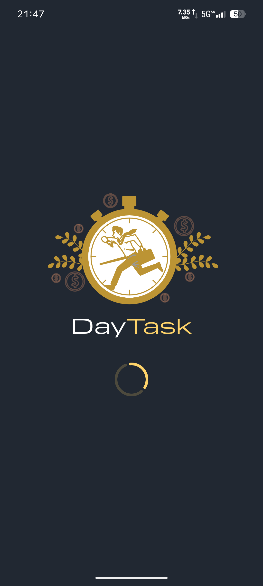
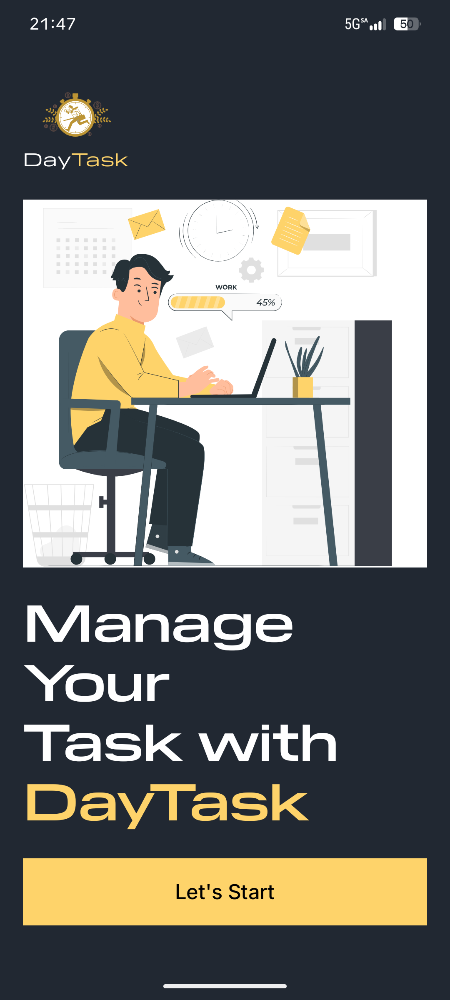
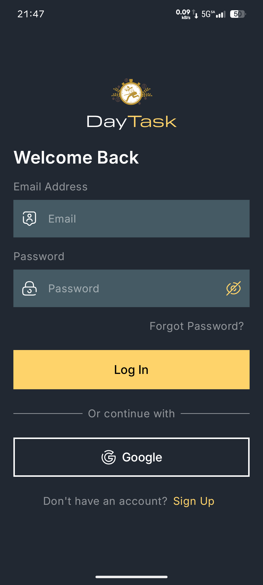
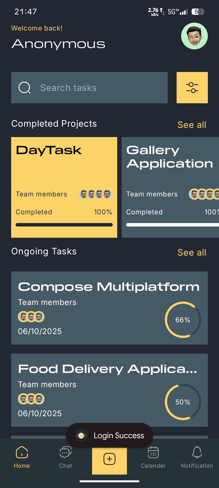
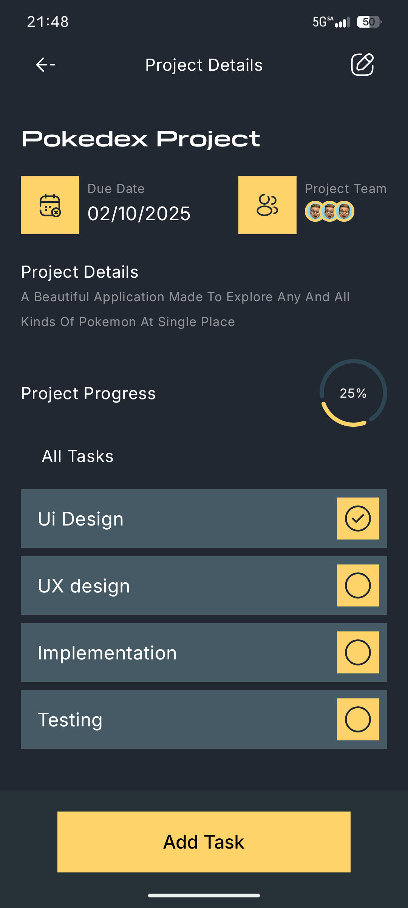
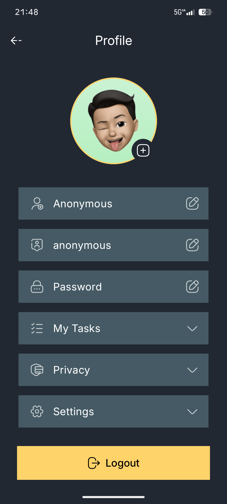

# 🕒 DayTask

**DayTask** is a modern task management Android application built with **Jetpack Compose**, designed to help users efficiently organize, monitor, and manage their daily projects and to-dos in an elegant interface.

---

## ✨ Features

- 🏁 **Splash & Onboarding Screens**  
  A smooth launch experience introducing the app’s purpose and brand identity.

- 📋 **Task Management Dashboard**  
  View all **completed** and **ongoing projects** in a structured and interactive layout.

- 👥 **Team Collaboration**  
  Displays team members assigned to each project, enhancing teamwork visibility.

- 📈 **Progress Tracking**  
  Real-time project completion percentages with visual indicators.

- 🔍 **Smart Search & Filter**  
  Quickly find and filter tasks by name or status.

- 📅 **Calendar Integration**  
  Plan and visualize upcoming deadlines.

- 🔔 **Notifications**  
  Get timely alerts for important tasks or updates.

---

## 🖼️ Screenshots

The screenshots below showcase the sleek dark UI with golden highlights for key actions and metrics.

| Splash Screen | Onboarding |                        Login / Sign Up                         |
|:--------------:|:------------:|:--------------------------------------------------------------:|
|  |  |  |

| Home Dashboard |                             Project Details                              |                        Profile Management                        |
|:---------------:|:------------------------------------------------------------------------:|:----------------------------------------------------------------:|
|  |  |  |

---

## 🛠️ Tech Stack

- **Language:** Kotlin
- **UI Toolkit:** Jetpack Compose
- **Architecture:** MVI (Model–View–Intent)
- **Navigation:** Jetpack Navigation Component
- **State Management:** ViewModel + StateFlow
- **Database:** Room / Firebase
- **Async Handling:** Kotlin Coroutines
- **Predictive Back** Predictive back gestures

---

## 🚀 Getting Started

### Prerequisites
- Android Studio (latest version preferred)
- Kotlin 1.9+
- Gradle 8+

### Installation

1. Clone the repository:
   ```bash
   git clone https://github.com/Keyur1291/DayTask.git

## Meet the Developer:

* **Github::** [@Keyur1291](https://www.github.com/Keyur1291)
* **X(Formerly Twitter)** [@Keyur12901](https://www.x.com/Keyur12901)